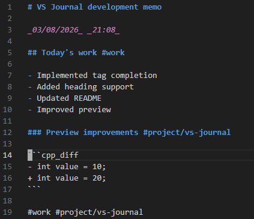
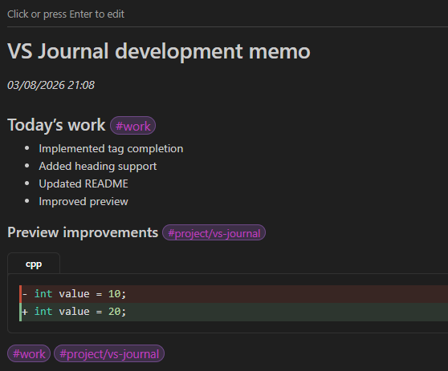
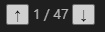
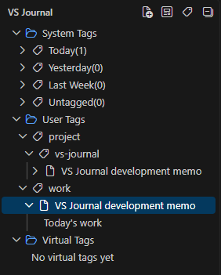
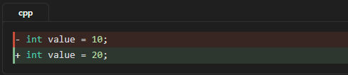

# VS Journal

VS Journal は、Visual Studio Code 上で日々の作業メモを素早く記録するための軽量ジャーナル拡張機能です。

Markdown 形式のテキストをハッシュタグで整理し、VS Code から離れることなくシームレスに作業ログを残すことができます。

GitHub  
https://github.com/watagashi-dev/vs-journal

---

## 概要

VS Journal は、VS Code を日常的に使用する人が **ストレスなく作業メモを残すこと** を目的に設計されました。

- **ローカル完結**: データはすべてローカルの Markdown ファイルとして保存されます。
- **データベース不要**: 特別なデータベース管理は不要で、ファイルベースで管理されます。
- **高速動作**: 軽量な設計により、思考を妨げません。

---

## スクリーンショット

### エントリーの編集

Markdown で手軽に記述できます。タグの入力補完もサポートしています。  


### マークダウンのプレビュー

タグツリーのタイトル（タイトル未設定の場合はファイル名）をクリックすることで、  
プレビュー画面に移動できます。

プレビュー画面ではクリックまたは Enter キーで編集画面に移行できます。  
また、タグをクリックすると該当するメモをまとめて表示できます。



仮想タグにより選択された項目のプレビュー画面では、仮想タグが2つ以上ある場合、
下記のようなナビゲーションが表示され、仮想タグ間をジャンプすることができます。



- Ctrl + ↑ / ↓ によるキーボード操作に対応
- スクロール位置に応じて現在位置が自動的に同期されます

### タグビュー

ハッシュタグに基づき、メモをツリー構造で整理・閲覧できます。  
タグは自動でソートされます。



---

## 主な特徴

### 1. 軽量設計

VS Journal は高速に動作することを最優先に設計されています。複雑な設定や重いデータベースは必要ありません。

---

### 2. Markdown ベース

メモはすべて標準的な `.md` ファイルとして保存されます。

- VS Code の強力な編集機能をそのまま活用できます
- データのポータビリティが高く、他ツールへの移行やバックアップも容易です
- フォルダ階層による管理にも対応しています

---

### 3. ハッシュタグによる整理

メモの内容をハッシュタグで柔軟に整理できます。

**使用例:**
```
#work
#idea
#project/vs-journal
```

#### 階層タグ

タグは `/` 区切りで階層化できます（最大4階層）

例:
```
#project/dev/frontend
```

#### タグのルール

- タグは「独立した行」または「見出し行」に記述されたもののみ認識されます
- 文中のハッシュタグは無視されます
- コードブロック内のハッシュタグは無視されます
- インラインコード内のハッシュタグもタグとして扱われません

---

### 4. 仮想タグ (Virtual Tags)

物理的なハッシュタグをファイルに書き込むことなく、検索条件に基づいて動的にタグ付けを行うことができます。

- 検索条件を仮想タグとして保存可能
- 仮想タグに一致した箇所をプレビュー上でハイライト表示
- 一致したメモをまとめて表示可能
- 一致箇所間をナビゲーションで移動可能
- タグ名の一部分が一致した場合も該当箇所を強調表示
- リンクや画像のパス・タイトルなども検索対象になります

---

### 5. タグ入力補完

既存タグをもとに入力補完が表示されます。

- 表記ゆれを防止
- 高速入力
- 補完候補は自動でソート
- よく使用するタグほど上位に表示されます
- 補完順位は自動的に保存されます

---

### 6. プレビュー機能

Markdown プレビューを拡張し、読みやすさと操作性を向上させています。

- コードブロックのシンタックスハイライト対応
- コードブロックの言語ラベルのタブ表示
- コードブロックの拡張表示対応
  - diff表示
  - 折り返し表示
  - 行番号表示
  - 言語タブの非表示
- 簡単なTeX形式数式の表示対応
- テーブル表示の最適化（ヘッダー強調・罫線調整）
- チェックリストの視認性改善
- 外部画像のインライン表示対応
- 外部リンクのオープン対応
- ユーザータグおよび仮想タグのハイライト表示

#### タグによる連結表示

タグをクリックすると、そのタグに属する複数のメモを連結してプレビュー表示できます。

※大量のメモを扱う場合は、パフォーマンス維持のため表示内容が制限されることがあります

---

### VS Journal Markdown Extensions

VS Journal は標準的な Markdown に加え、いくつかの拡張記法をサポートしています。

#### 数式

簡単な TeX 形式の数式をプレビューできます。

インライン数式:

```markdown
$E = mc^2$
```

ブロック数式:

```markdown
$$
\sum_{i=1}^{n} i
$$
```

#### Diff コードブロック

diff 形式のコードブロックを色付きで表示できます。
通常の言語指定と組み合わせて利用できます。

````text
```cpp_diff
- int value = 10;
+ int value = 20;
```
````



コードブロック表示オプション

コードブロックの言語指定にオプションを追加することで、表示方法を変更できます。

```typescript wrap linenumber
const longText = "This is a long line...";
```

利用可能なオプション:

| Option | Description |
| --- | --- |
| `diff` | 行頭の`+-`による差分に基づく色付け表示されます |
| `wrap` | 長い行を折り返して表示します |
| `linenumber` | 行番号を表示します |
| `notab` | 言語タブを非表示にします |

画像の ALT テキストにオプションを指定することで表示サイズを変更できます。

指定可能オプション:

| オプション | 説明 |
|------------|------|
| width | 幅(px)を指定 |
| height | 高さ(px)を指定 |

幅を指定:

```markdown

```

高さを指定:

```markdown

```

複数指定:

```markdown

```

---

### 7. 画像・ファイルリンク管理

Markdown編集中に画像やファイルへのリンクを簡単に挿入できます。

- クリップボード画像の保存と貼り付け
- ファイル・フォルダーリンクの挿入
- プレビューからローカルファイルやフォルダーをオープン
- ALTテキストによる画像表示サイズ指定

---

### 8. タグビュー

タグツリーでメモを整理・閲覧できます。

- タグはシステムタグ・ユーザータグ・仮想タグのグループごとに表示
- 各グループを折りたたんで表示できます
- タグは階層構造で表示
- アルファベット順で自動ソート
- 各タグ配下のファイルはタイトル・作成日時・更新日時で並べ替え可能
- コンテクストメニューからファイルのソート条件を変更可能
  - タイトル
  - 作成日時
  - 更新日時
  - 昇順 / 降順
- タグの開閉状態を保持
- タグごとのファイルのソート条件を保持

タグツリーのコンテクストメニューから、ファイルや仮想タグの管理、
ファイルのソート条件の変更を行えます。

仮想タグの削除時には確認ダイアログを表示する設定も利用できます。

---

### 9. システムタグ

ユーザーが付与しなくても自動的に分類されるタグです。

- `Today` : 当日更新されたメモ
- `Untagged` : ユーザータグが存在しないメモ

これらはファイル内容ではなく状態に基づいて自動付与されます。

※ システムタグは設定により表示を制御できます。

---

### 10. キーボード操作

編集中でも素早くプレビューできます。

- ショートカットで即プレビュー表示
- プレビューからワンクリックで編集に戻る
- 仮想タグのナビゲーションが表示される条件では、Ctrl+上下矢印でタグ間のジャンプ

---

## 使い方

### 新しいメモを作成する

コマンドパレットから:

```
VS Journal: New Entry
```

ショートカット:

```
Ctrl+Alt+N (Windows, Linux)
Cmd+Option+N (Mac)
```

---

### メモを書く

```markdown
# 2026/03/05作業メモ

_2026年03月05日_ _10:15_

今日やったこと

- README作成
- タグ機能実装
- UI調整

#work #project/vs-journal
```

新規作成時:

- 1行目に見出しを自動生成
- 2行目に日時を自動挿入（設定で無効化可能）
- ファイル名形式や保存先フォルダ構造は設定で変更可能

---

### 画像やファイルリンクを挿入する

Markdown編集中は、エディターのコンテクストメニューから以下の機能を利用できます。

- VSJ: 画像を貼り付け
- VSJ: ファイルへのリンクを挿入
- VSJ: フォルダーへのリンクを挿入

ショートカット:

| 操作 | Windows/Linux | macOS |
|--------|--------|--------|
| 画像貼り付け | Ctrl+Alt+V | Cmd+Option+V |
| ファイルリンク挿入 | Ctrl+Alt+I | Cmd+Option+I |
| フォルダーリンク挿入 | Ctrl+Alt+Shift+I | Cmd+Option+Shift+I |

画像貼り付けでは、クリップボード上の画像を保存し、Markdown画像リンクを挿入します。
Journal内のファイル・フォルダーリンクは相対パスで保存されます。

画像にはALTテキストを利用して表示サイズを指定できます。
詳しくは「VS Journal Markdown Extensions」を参照してください。

### メモをプレビュー

以下の方法で表示できます:

- タグビューでクリック
- サイドパネルの上部のボタンから実行
- コマンド実行
- キーボードショートカット

```
VS Journal: Preview Entry
```

ショートカット:

```
Ctrl+Alt+P (Windows, Linux)
Cmd+Option+P (Mac)
```

---

## コマンド

| コマンド                              | 説明          |
|-------------------------------------|-------------|
| VS Journal: New Entry                | 新しいメモを作成 |
| VS Journal: Preview Entry            | メモをプレビュー |
| VS Journal: Select Journal Directory | 保存フォルダ変更 |
| VS Journal: Add Virtual Tag         | 仮想タグを追加   |

---

## キーボードショートカット

| 操作 | Windows / Linux | macOS |
|------|-----------------|-------|
| 新しいメモ | Ctrl+Alt+N | Cmd+Option+N |
| プレビュー | Ctrl+Alt+P | Cmd+Option+P |
| 画像貼り付け | Ctrl+Alt+V | Cmd+Option+V |
| ファイルリンク挿入 | Ctrl+Alt+I | Cmd+Option+I |
| フォルダーリンク挿入 | Ctrl+Alt+Shift+I | Cmd+Option+Shift+I |

---

## 設定

| 設定 | 説明 | デフォルト |
|------|------|----------|
| vsJournal.journalDir | 保存フォルダ | $HOME/VSJournal |
| vsJournal.autoSave | 自動保存(ms) | 800 |
| vsJournal.enableDateTime | 日時自動挿入 | true |
| vsJournal.confirmDeleteFile | ファイル削除確認 | true |
| vsJournal.confirmDeleteVirtualTag | 仮想タグ削除確認 | true |
| vsJournal.virtualTags.caseSensitive | 仮想タグの大文字小文字区別 | false |
| vsJournal.systemTags.visibility | システムタグ表示制御 | { "Today": true } |
| vsJournal.fileNameStyle | 新規メモのファイル名形式 | datetime-minute |
| vsJournal.folderStructure | 新規メモの保存フォルダ構造 | flat |
| vsJournal.paste.saveLocation | 貼り付け画像保存先 | structured |
| vsJournal.internalOpenExtensions | VS Code内部で開く拡張子 | [".md"] |

`confirmDeleteVirtualTag` を有効にすると、
仮想タグ削除時に確認ダイアログが表示されます。

例:

```json
{
  "vsJournal.journalDir": "/path/to/journal",
  "vsJournal.autoSave": 30000,
  "vsJournal.enableDateTime": false,
  "vsJournal.confirmDeleteFile": false,
  "vsJournal.confirmDeleteVirtualTag": false,
  "vsJournal.virtualTags.caseSensitive": true,
  "vsJournal.systemTags.visibility": {
    "Today": true
  },
  "vsJournal.fileNameStyle": "datetime-minute",
  "vsJournal.folderStructure": "yyyy-mm-dd",
  "vsJournal.paste.saveLocation": "structured",
  "vsJournal.internalOpenExtensions": [
    ".md",
    ".txt"
  ]
}
```

---

## データ保存構造

例（flat）

```
Journal Directory/
  2025-03-07-10-08.md
  2025-03-08-14-30.md
  2026-01-01-18-23.md
```

例（yyyy-mm-dd）

```
Journal Directory/
  2026/
    05/
      07/
        2026-05-07-13-45.md
```

画像貼り付け機能を使用した場合は、ノートに関連付けられた画像保存フォルダが作成されます。

---

## 想定ユーザー

- VS Code を日常的に利用する人
- 作業ログやアイデアを記録したい人
- Markdown ベースでメモを管理したい人
- 軽量なメモ環境を求める人

---

## このツールを作った理由

- VS Code 内で完結するメモが欲しかった
- 関連情報をまとめられる仕組みが欲しかった
- シンプルなタグベース管理を実現したかった
- 軽量であることを重視したかった
- Emacs の HOWM に影響を受けて設計

---

## 今後の予定

VS Journal は、シンプルさを維持しながら、より柔軟で強力なメモ環境へ進化していきます。

### タグと情報整理の強化
- 見出しを活用した情報整理機能
- より柔軟なメモ表示機能

### ライティング体験の向上
- Markdown 編集サポートの強化

---

## ライセンス

MIT License
