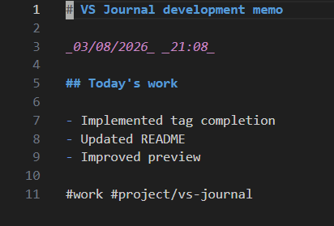
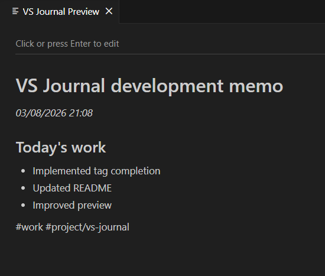
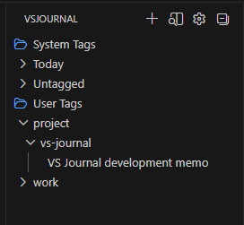

# VS Journal

VS Journal is a lightweight journaling extension for Visual Studio Code, designed for quickly capturing daily work notes.

It allows you to organize Markdown-based notes with hashtags, letting you keep a seamless work log without ever leaving your editor.

GitHub: https://github.com/watagashi-dev/vs-journal

---

## Overview

VS Journal is designed for developers who use VS Code daily and want a frictionless way to keep work notes.

- **Fully Local**: All data is stored as local Markdown files.
- **No Database Required**: Notes are managed on a simple file-based system.
- **High Performance**: The lightweight design ensures it won't interrupt your workflow.

---

## Installation

Install **VS Journal** from the VS Code Marketplace.

1. Open the **Extensions** view (`Ctrl+Shift+X`)
2. Search for **VS Journal**
3. Click **Install**

Alternatively, install it directly from the marketplace:

https://marketplace.visualstudio.com/items?itemName=watagashi-dev.vs-journal-tag

---

## Quick Start

1. Open the **Command Palette** (`Ctrl+Shift+P` / `Cmd+Shift+P`)
2. Run **VS Journal: New Entry**
3. Start writing your notes in Markdown and organize them using hashtags.

**Example:**
```markdown
# Work Notes — 2026-03-05

_March 5, 2026_ _10:15_

## Today's Work

- Updated the README
- Implemented tag support
- Improved the UI

#work #project/vs-journal
```

---
## Screenshots

### Editing an Entry

Easily write notes in Markdown. Tag autocompletion is also supported.  


### Markdown Preview

Click a title in the tag tree to open the preview.
In the preview, click anywhere or press `Enter` to switch back to the editor.  


### Tag View

Organize and browse your notes in a tree structure based on hashtags.  


---

## Features

### 1. Lightweight by Design

VS Journal is built to be fast. It doesn't require complex setups or heavy databases.

### 2. Markdown-Based

All notes are saved as standard `.md` files.
- Leverage VS Code's powerful editing features.
- Your data is portable, making backups or migrations to other tools easy.

### 3. Hashtag-Based Organization

Flexibly organize your content using hashtags.

**Example:**
```markdown
#work
#idea
#project/vs-journal
```

**Hierarchical Tags:**
Tags can be nested using a `/` separator (up to 4 levels deep).
Example: `#project/dev/frontend`

> **Note:** Hashtags are only recognized as tags when they appear on their own line or on a heading line. Hashtags within a sentence are ignored.

### 4. Tag Autocompletion

Existing tags are suggested as you type, helping you avoid typos and classify notes efficiently.

### 5. Local File Storage

By default, notes are saved in `$HOME/vsJournal`, but you can configure this to any folder you prefer.

---

## Usage

### Creating a New Entry

Run the following command from the Command Palette (`Ctrl+Shift+P` / `Cmd+Shift+P`):

```plaintext
VS Journal: New Entry
```

**Shortcut:**
- Windows / Linux: `Ctrl+Alt+N`
- macOS: `Cmd+Option+N`

### Writing a Note

Simply write your notes in Markdown. When creating a new file, the current date and time can be automatically inserted based on your settings.

### Previewing a Note

Click on a file in the tag tree to open a preview.
- Click anywhere in the preview or press `Enter` to switch to edit mode.
- Click an external link to open it in your browser.

---

## Commands

| Command | Description |
| :--- | :--- |
| `VS Journal: New Entry` | Creates a new journal entry. |
| `VS Journal: Preview Entry` | Previews the current entry. |
| `VS Journal: Select Journal Directory` | Changes the folder where notes are saved. |

---

## Keyboard Shortcuts

| Action | Windows / Linux | macOS |
| :--- | :--- | :--- |
| Create a new entry | `Ctrl+Alt+N` | `Cmd+Option+N` |
| Focus on Tag View | `Ctrl+Alt+J` | `Cmd+Option+J` |

---

## Configuration

You can customize the extension's behavior in your VS Code settings (`settings.json`).

| ID | Description | Default |
| :--- | :--- | :--- |
| `vsJournal.journalDir` | The folder path where journal files are stored. | `$HOME/vsJournal` |
| `vsJournal.autoSave` | The delay in milliseconds before auto-saving. Set to `0` to disable. | `800` |
| `vsJournal.enableDateTime` | Whether to automatically insert the date and time into new files. | `true` |

**Example `settings.json`:**
```json
{
  "vsJournal.journalDir": "/Users/username/Document/Journal",
  "vsJournal.autoSave": 3000,
  "vsJournal.enableDateTime": false
}
```

---

## Directory Structure

Files are stored flatly in the specified directory without creating subfolders, simplifying file management.

```text
vsJournal/
├── 2025-03-07-10-08.md
├── 2025-03-08-14-30.md
└── 2026-01-01-18-23.md
```

---

## Philosophy

This tool was created for those who want a simple, fast, and self-contained note-taking system that lives inside VS Code. The goal is to reduce context switching and manage notes across different topics (tags) and dates.

The design is heavily inspired by **HOWM** (Hitori Otegaru Wiki Modoki) for Emacs.

---

## Roadmap

- [ ] Add support for virtual tags
- [ ] Concatenated preview for multiple files
- [ ] Enhanced Markdown input assistance
- [ ] Improved tree view for heading tags

---

## License

MIT License
